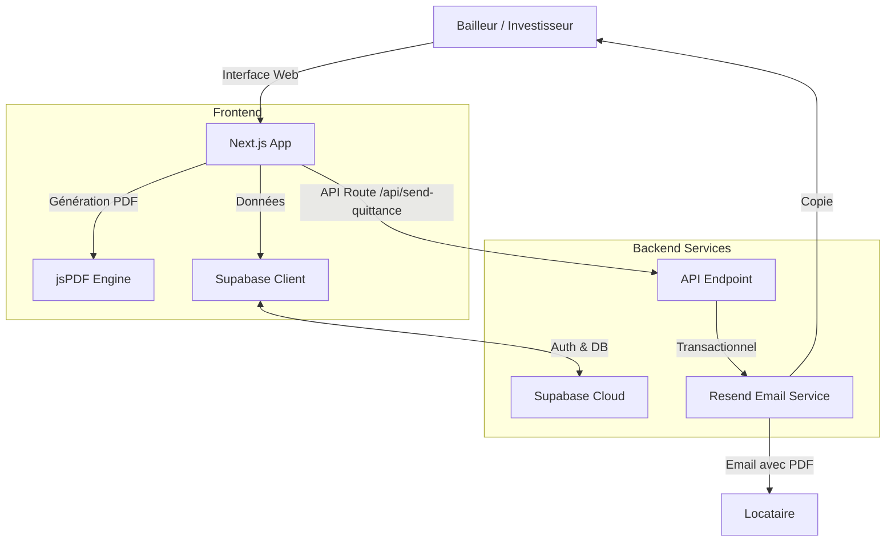

# 🏠 Gestionnaire de Quittances de Loyer

Une application moderne et intuitive pour permettre aux bailleurs et investisseurs de gérer leurs biens immobiliers et de générer automatiquement des quittances de loyer pour leurs locataires.


## ✨ Fonctionnalités

- **Gestion Multi-Bailleurs**: Gérez plusieurs profils de propriétaires (Particuliers ou Sociétés/SCI).
- **Suivi des Locataires**: Base de données centralisée de vos locataires.
- **Biens Immobiliers**: Gestion des appartements, colocations et loyers.
- **Génération de Quittances**:
  - Création PDF automatique et professionnelle.
  - Calculs automatiques des périodes et montants.
  - Support de la signature numérique.
- **Envoi Automatisé**:
  - Envoi par Email via **Resend** (Supporte les domaines personnalisés).
  - Copies automatiques aux bailleurs.
- **Sécurité**: Authentification et base de données gérées par **Supabase**.

## 🛠 Stack Technique

- **Frontend**: [Next.js 15](https://nextjs.org/) (App Directory), [React 19](https://react.dev/)
- **Langage**: [TypeScript](https://www.typescriptlang.org/)
- **Styling**: [Tailwind CSS](https://tailwindcss.com/), [Shadcn/UI](https://ui.shadcn.com/)
- **Backend/Auth**: [Supabase](https://supabase.com/)
- **Email**: [Resend](https://resend.com/)
- **PDF**: `jspdf`

## 🏗 Architecture



## 🚀 Installation Locale

1.  **Cloner le projet**
    ```bash
    git clone https://github.com/votre-username/quittance-loyer.git
    cd quittance-loyer
    ```

2.  **Installer les dépendances**
    ```bash
    npm install
    # ou
    pnpm install
    ```

3.  **Configurer l'environnement**
    Créer un fichier `.env.local` à la racine :
    ```env
    # Supabase (Base de données & Auth)
    NEXT_PUBLIC_SUPABASE_URL=votre_url_supabase
    NEXT_PUBLIC_SUPABASE_ANON_KEY=votre_cle_anon
    SUPABASE_SERVICE_ROLE_KEY=votre_cle_service

    # Resend (Emails)
    RESEND_API_KEY=re_votre_api_key
    # Email expéditeur (Doit être vérifié sur Resend en prod)
    EMAIL_FROM=onboarding@resend.dev
    ```

4.  **Lancer le serveur de développement**
    ```bash
    npm run dev
    ```
    Ouvrir [http://localhost:3000](http://localhost:3000).

## 📦 Déploiement

Pour passer en production et envoyer de vrais emails à vos locataires, consultez le guide étape par étape :

👉 **[Voir le guide de déploiement (NEXT_STEPS.md)](./NEXT_STEPS.md)**

## 📄 Licence

MIT
